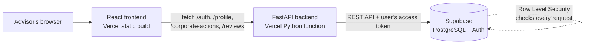

# CAConnect — Corporate Actions Portal

A self-service portal that lets investment advisors review overseas corporate actions (dividends, splits, rights issues, mergers) and sign them off without emailing the operations team.

**Live app:** https://caconnect-brown.vercel.app
Sign up with any email and a password of at least 6 characters.

> Built for BUS4012 Vibe Coding for Startups (La Trobe University), Assignment 3.
> Corporate action data is mock data for demonstration only.

---

## Features

- **Real accounts** — sign up and log in with Supabase Auth
- **Advisor profile** — name, branch, markets covered and notification preference, saved to the database
- **Corporate actions dashboard** — 8 events loaded from the database, with status tags (Custodian-confirmed, Preliminary, Pending)
- **Plain-English event summaries** — what each event means for the client
- **Review and sign-off** — a step-by-step review form with validation
- **Server-side business rule** — only Custodian-confirmed events can be signed off; the decision is made by the backend, not the browser
- **History** — the advisor's own sign-offs with reference numbers (CA-YYYY-NNNN)
- **User control** — "Delete this record" removes a review from the database
- **14-day retention** — reviews older than 14 days are deleted automatically

## Architecture



- The **frontend** never talks to Supabase directly and contains no keys. It only knows the backend URL.
- The **backend** calls Supabase with the logged-in user's own token, so **Row Level Security** applies to every request: each advisor can only read and change their own data.
- In production, frontend and backend share one domain, so no CORS is needed.

## Tech stack

| Layer | Technology |
|---|---|
| Frontend | React, TypeScript, Vite, Tailwind CSS, React Router |
| Backend | Python 3.11, FastAPI, httpx |
| Database and auth | Supabase (PostgreSQL, Auth, Row Level Security) |
| Hosting | Vercel |
| Built with | Cline in VS Code (Plan Mode → Act Mode) |

## Project structure

```
caconnect/
├── api/
│   └── index.py              # Vercel entry point — imports the FastAPI app
├── backend/
│   ├── main.py               # API endpoints
│   ├── setup_database.sql    # Tables, RLS policies, trigger, seed data
│   ├── database.py           # Runs the SQL setup (manual, one-off)
│   ├── check_tables.py       # Verifies tables, RLS, policies and trigger
│   ├── test_database_connection.py
│   ├── requirements.txt
│   └── .env.example          # Template — real values are never committed
├── frontend/
│   ├── src/
│   │   ├── pages/            # Login, Setup, Dashboard, Event, Review, Confirm, Result, History
│   │   ├── components/ui/    # Reusable UI kit (FormSection, TextField, StatusTag, IconButton...)
│   │   ├── lib/api.ts        # All backend calls in one place
│   │   └── App.tsx           # Central state and routing
│   └── .env.production       # VITE_API_URL= (empty: same domain)
├── requirements.txt          # Copy of backend/requirements.txt for Vercel
├── vercel.json               # Build and routing config
└── .gitignore
```

## API endpoints

| Method | Path | Purpose |
|---|---|---|
| POST | `/auth/signup` | Create an account |
| POST | `/auth/login` | Log in, returns an access token |
| GET / PUT | `/profile` | Read or update the advisor profile |
| GET | `/corporate-actions` | List all events |
| GET | `/corporate-actions/{id}` | One event |
| GET | `/reviews` | The user's reviews from the last 14 days |
| POST | `/reviews` | Submit a sign-off (business rule applied here) |
| DELETE | `/reviews/{reference}` | Delete one of the user's reviews |
| GET | `/health` | Health check |

## Security

- **No secrets in Git** — `backend/.env` is listed in `.gitignore`; only `.env.example` with placeholders is committed.
- **Minimum secrets in production** — Vercel holds only `SUPABASE_URL` and `SUPABASE_ANON_KEY`. The database password is not stored on the hosting platform.
- **Row Level Security** on all three tables: `profiles` and `reviews` are private to each user; `corporate_actions` is read-only.
- **Server-side business rule** — sign-off approval cannot be changed from the browser.
- **Learning-project limits** — the access token is stored in localStorage and email confirmation is turned off for testing. A production version should use more secure token storage and turn email confirmation back on.

## Run locally (Windows PowerShell)

**1. Backend**

```powershell
cd backend
python -m venv venv
.\venv\Scripts\activate
pip install -r requirements.txt
copy .env.example .env      # then fill in your own Supabase values
python database.py          # one-off: creates tables, policies and seed data
uvicorn main:app --reload
```

**2. Frontend** (in a second terminal)

```powershell
cd frontend
npm install
npm run dev
```

Open http://localhost:5173. The frontend reads `VITE_API_URL=http://127.0.0.1:8000` from `frontend/.env.development`.

## Environment variables

| Name | Where | Used by |
|---|---|---|
| `SUPABASE_URL` | `backend/.env` and Vercel | Backend |
| `SUPABASE_ANON_KEY` | `backend/.env` and Vercel | Backend |
| `DATABASE_URL` | `backend/.env` only | Setup scripts only |

## Author

Emine Sultan Gok — Master of Business Analytics, La Trobe University
